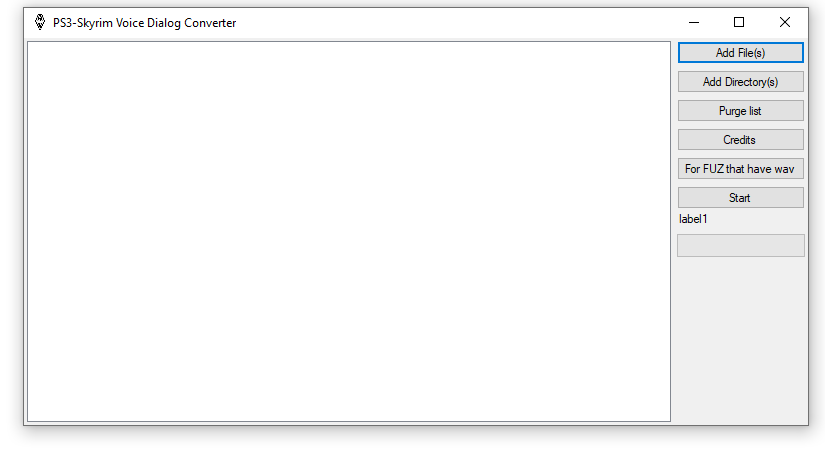

# PS3-Skyrim-Voice-Dialog-Converter
Check the changelog.MD for more info
This tool can be used to convert given Voice dialog(.fuz) to PS3 format
Requirements:
MSEnc.exe found in the PS3 SDK ("Can't give a link sorry")
ENCVAG.DLL found in the PS3 SDK ("Can't give a link sorry")
xWMAEncode.exe found in the DirectX SDK ("https://www.microsoft.com/en-us/download/details.aspx?id=6812")
fuz_extractor.exe found on the skyrim nexus ("https://www.nexusmods.com/skyrim/mods/9797/")
How to install the required files:
step one(1): copy all the required files to the "Data" folder
You are done use the tool as you wish

